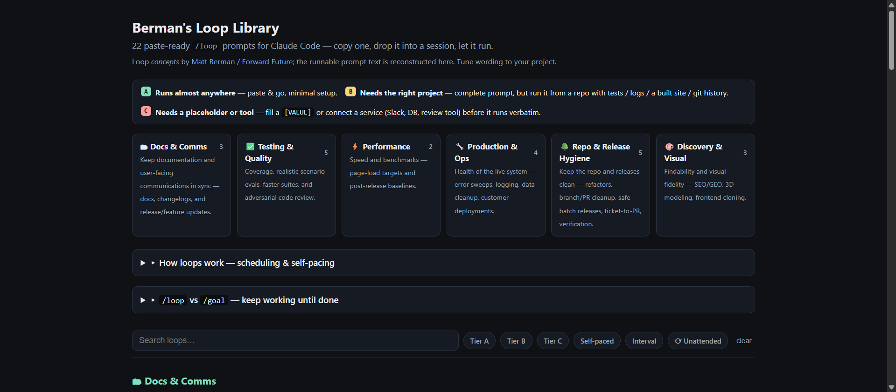

# Loop Library — paste-ready `/loop` prompts for Claude Code

> ### 📚 Based on **[Matt Berman's Loop Library](https://signals.forwardfuture.ai/loop-library/)** (Forward Future)
> The 22 loop **concepts** — trigger → action → verify → stop — are Matt Berman's, published at
> **<https://signals.forwardfuture.ai/loop-library/>**. This repo's contribution is the *runnable
> prompt text* for each, plus a site to copy them from. All credit for the ideas goes to him.

**🔗 Live site: https://az9713.github.io/loop-library/**

> ▶ **[Open the live, interactive site →](https://az9713.github.io/loop-library/)** (the image above is a preview — GitHub can't embed live HTML in a README, but the site has working filters and copy buttons.)

22 repeatable AI-agent workflows from [Matt Berman / Forward Future's Loop
Library](https://signals.forwardfuture.ai/loop-library/), turned into
**copy-and-paste `/loop` prompts** you can drop straight into a Claude Code session.

Berman published the loop *concepts* (trigger → action → verify → stop). The missing
piece for practitioners was the actual runnable prompt text — that's what this provides.

## What's in this repo

**The product** — the prompts and the site:

| File | What it is |
|------|------------|
| [`index.html`](index.html) | Filterable card grid of all 22 loops with one-click **Copy** buttons. Browse by domain, filter by setup tier / scheduling mode. **This is the site.** |
| [`berman-loops.md`](berman-loops.md) | The same content as a Markdown reference, with deeper notes on scheduling, self-pacing, and `/loop` vs `/goal`. |
| [`mockups.html`](mockups.html) | Three candidate layouts (card grid / sidebar / accordion) behind a tab switcher — kept for reference. |

**The automation** — keeps the repo in sync with the source (see [next section](#how-this-repo-stays-up-to-date)):

| File | What it is |
|------|------------|
| [`.github/workflows/sync-loops.yml`](.github/workflows/sync-loops.yml) | The weekly GitHub Action: when/how the sync runs. SHA-pinned action, least-privilege, runs on a Claude Max token. |
| [`.claude/sync-loops.md`](.claude/sync-loops.md) | The agent's task instructions: what to do each run (detect new loops → open a PR). |
| [`.github/dependabot.yml`](.github/dependabot.yml) | Weekly Dependabot — opens PRs to bump the pinned action when a new version ships. |

**The docs** — learn it, then operate it:

| File | What it is |
|------|------------|
| [`docs/sync-runbook.md`](docs/sync-runbook.md) | **Operator cheat-sheet** — how to run, watch, and manage the sync Action (browser + `gh` commands). |
| [`docs/github-actions-tutorial.md`](docs/github-actions-tutorial.md) | GitHub Actions explained from scratch, using this repo's self-sync workflow as the worked example. |
| [`docs/loop-vs-goal.md`](docs/loop-vs-goal.md) | `/loop` vs `/goal` deep-dive — the core difference, when (not) to combine them, and worked examples. |

## How to use a loop

1. Open the [site](https://az9713.github.io/loop-library/) and find a loop.
2. Hit **Copy**.
3. Paste it into Claude Code and press Enter.

Each loop is tagged:

- **Tier A / B / C** — how much setup it needs (run anywhere → needs the right project → needs a placeholder or external tool).
- **Mode** — *self-paced* (runs until done, stops itself) vs *fixed interval* (`1d`, `30m`…).
- **⟳ Routines** — wants unattended/overnight running, so back it with a cloud Routine rather than an in-session `/loop`.

## How this repo stays up to date

Berman's library will grow; this repo keeps up on its own. A GitHub Action runs **every Monday
(09:00 UTC)**, fetches the source, and compares it to the loops already here:

- **New loops found** → it writes paste-ready prompts for them and **opens a pull request** for you
  to review and merge (merging auto-rebuilds the site). It never publishes unreviewed.
- **Nothing new** → it exits silently, leaving a one-line verdict on the run's Summary tab.

Properties worth knowing:

- **No API bill** — authenticates with a Claude **Max** subscription (`CLAUDE_CODE_OAUTH_TOKEN`
  secret), so usage counts against the Max plan, not metered API credit.
- **Hardened** — the action is pinned to an immutable commit SHA, with least-privilege permissions;
  **Dependabot** opens PRs to keep that pin current.
- **You're notified when it matters** — a failed run sends an email **and** opens a GitHub issue; a
  successful run with changes shows up as a PR. Routine no-op runs stay quiet.

To run it on demand or manage it, see the **[operator runbook](docs/sync-runbook.md)**. To
understand how it all works, see the **[GitHub Actions tutorial](docs/github-actions-tutorial.md)**.

## `/loop` vs `/goal`, in one line

Self-paced `/loop` **waits between rounds and trusts itself** to decide it's done; `/goal`
**runs flat-out with a second model as the judge**. Use `/loop` when there's something
external to wait for; use `/goal` when you can state a clear pass/fail end condition. The
site and the Markdown doc both include a short decision tree.

**Should you combine them?** Usually no — most `/goal` + `/loop` "combos" are redundant and
compile down to one mechanism. The only genuine nest is `/loop <interval> /goal <condition>`
("periodically drive to a checkable end state"); the reverse doesn't compose. Full principles,
the rule of thumb, and worked examples are in **[`docs/loop-vs-goal.md`](docs/loop-vs-goal.md)**
(sourced from the official [`/goal`](https://code.claude.com/docs/en/goal) and
[`/loop`](https://code.claude.com/docs/en/scheduled-tasks) docs).

---

*Loop concepts © Matt Berman / Forward Future. Prompt text reconstructed here for practitioner use. Built with Claude Code.*
